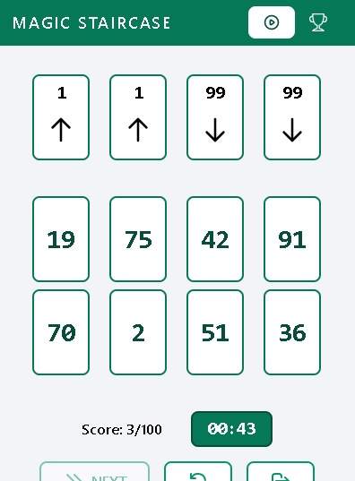
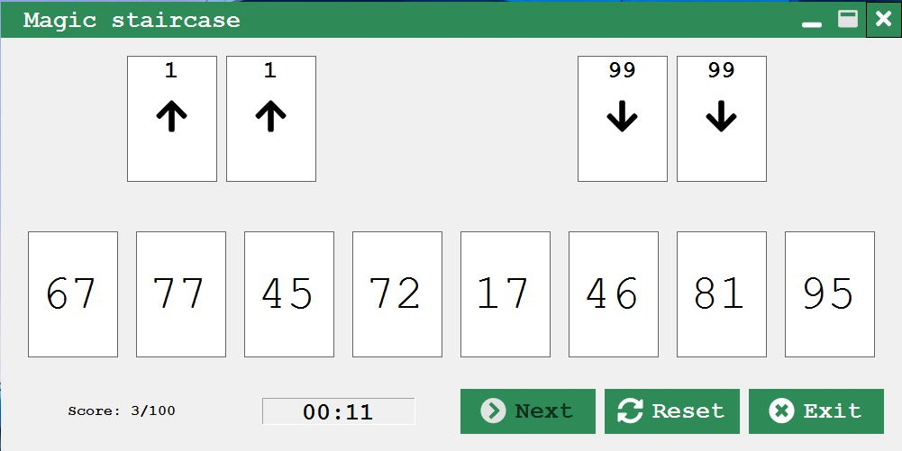

# Magic Staircase

The Game cardgame implementation 

https://boardgamegeek.com/boardgame/173090/game

- In Blazor webassembly 

[Demo deployed to netlify](https://competent-saha-cde062.netlify.app/)

- In windows forms

---

# How to release new versions in blazor wasm

- Pushes to master are automatically deployed to a netlify site in https://competent-saha-cde062.netlify.app/

# How to release new versions in winforms

1. Change version in MagicStaircase.Core.csproj file
2. Change version in installation project
3. Upload to github the generated file (MagisStaircase.msi) y and tag it with "v" and version number

